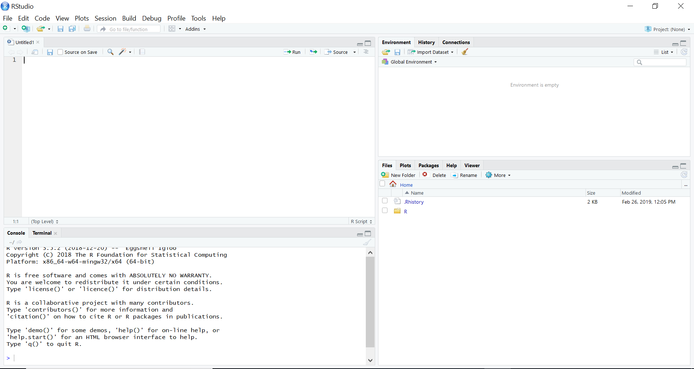

```{r setup, include=FALSE, message=FALSE}
knitr::opts_chunk$set(echo = FALSE, warning = FALSE, message = FALSE, indent = '    ')
options(scipen=9)
set.seed(42)

library(dplyr)
library(stringr)

available_packages <- available.packages(repos = "http://cran.us.r-project.org") %>% as_tibble()

open_licences <- str_detect(available_packages$License, 
                            regex('gpl|bsd|mit|apache|cc|GNU|artistic', ignore_case = T)) %>% 
  mean()
```


## What is R and why should you care

* R is a program for doing statistics and data analysis.
* R's advantages or selling points relative to other programs (e.g, SPSS, SAS, Stata, Minitab,
Python, Matlab, Maple, Mathematica, Tableau, Excel, SQL, and many others) come down to three
inter-related factors:
  * It is immensely powerful.
  * It is open-source.
  * It is very and increasingly widely used.

## R: A power tool for data analysis

The range and depth of statistical analyses and general data analyses that can
be accomplished with R is immense.

* Built into R are virtually the entire repertoire
  of widely known and used statistical methods. 

* R has a vast set of add-on or contributed
  packages. There are presently (`r format(Sys.Date(), "%d %h, %Y")`) 
  `r nrow(available_packages)` additional contributed
  packages.  
  
* R is a programming language that is specialized to efficiently
  manipulate and perform calculations on data.  

* The R programming language itself can be extended by interfacing with other
  programming languages (e.g. C/C++, Python, Spark, SQL). 

## R: Open source software

* R is free and open source software, distributed according to the GNU
public license. 
* Likewise, virtually all of contributed R packages are likewise free and open source.
* In practical terms, this means that is freely available for everyone to use, now and forever, on more
or less any device they choose.
* Open source software always has the potential to *go viral* and
develop a large self-sustaining community of user/developers. This has arguably happened with R.

## R: Popularity and widespread use

* When it comes to the computational implementation of modern statistical
methods, R is the de facto standard. For example, the
\href{https://www.jstatsoft.org}{Journal of Statistical Software} is
overwhelmingly dominated by programs written in R.
* R is also currently very highly ranked according to many rankings of
widely used programming languages of any kind. It ranked in the top 10 or top 20 
most widely used programming languages. 
* R is ranked as one of the top five
most popular data science programs in jobs for data scientists, and in
multiple surveys of data scientists, it is often ranked as the first or
second mostly widely used data science tool.

## A guided tour of RStudio

```{r, indent='', out.width="100%"}

```

## Introducing R commands
```{r, echo=FALSE}
knitr::opts_chunk$set(echo = TRUE, prompt = TRUE, warning = FALSE, message = FALSE, comment='#>')

# Thanks to 
# https://github.com/ramnathv/slidify/issues/189#issuecomment-15850008
# hook1 <- function(x){ gsub("```\n*```r*\n*", "", x) }
# hook2 <- function(x){ gsub("```\n+```\n", "", x) }
# knitr::knit_hooks$set(document = hook1)

```

* A useful way to think about R, and not an inaccurate one either, is that it is
simply a calculator.
```{r}
2 + 2 # addition
3 - 5 # subtraction
3 * 2 # multiplication
4 / 3 # division
(2 + 2) ^ (3 / 3.5) # exponents and brackets
```


## Variables and assignment

* If we type the following at the command prompt and then press Enter, the result is displayed but not stored.
```{r}
(12/3.5)^2 + (1/2.5)^3 + (1 + 2 + 3)^0.33
```

* We can, however, assign the value of the above calculation to a variable named `x`.
```{r}
x <- (12/3.5)^2 + (1/2.5)^3 + (1 + 2 + 3)^0.33           
```

* Now, we can use `x` as is it were a number.
```{r}
x ^ 2
x * 3.6
```

## Assignment rules

* In general, the assignment rule is 
```
name <- expression
```
* The `expression` is any R code that returns some value.

* The `name` must consist of letters, numbers, dots, and underscores. 
``` 
x123   # the following are acceptable
.x
x_y_z
xXx_123

_x   # the following are not acceptable
.2x 
x-y-z
```


## Vectors

* Vectors are one dimensional sequences of values.
* For example, if we want to
create a vector of the first 6 primes numbers, we could do the following.
```{r}
primes <- c(2, 3, 5, 7, 11, 13)
```
* We can now perform operations (arithmetic, logical, etc) on the `primes` vector.
```{r}
primes + 1
primes / 2
primes == 3
primes >= 7
```

## Indexing vectors

* For any vector, we can refer to individual elements using indexing
operations.  
```{r}
primes[1]
primes[5]
```

* If we want to refer to sets of elements, rather than just individual elements,
we can use vectors (made with the `c()` function) inside the indexing square
brackets. 
```{r}
primes[c(3, 5, 2)]
```

* If we use a negative valued index, we can refer to or all elements *except* one.
```{r}
primes[-1]
primes[-2]
```

## Vector types

* A vector be a sequence of numbers, logical values, or characters.
```{r}
nation <- c('ireland', 'england', 'scotland', 'wales')
```
* We can index this vector as we did with a vector of numbers.
```{r}
nation[1]
nation[2:3]
nation == 'ireland'
```

* The `class` function in R will identify the data type of the vector.
```{r}
class(primes)
class(nation)
```

## Logical vectors

* Another widely used type of vector is a logical or Boolean vector.
```{r}
is_male <- c(TRUE, FALSE, TRUE, TRUE, FALSE)
```

* This could also be created more succinctly as follows.
```{r}
is_male <- c(T, F, T, T, F)
```

* Using `class`, we can verify that this vector is a logical vector.
```{r}
class(is_male)
```

* We can index logical vectors just like numeric or character vectors.
```{r}
is_male[2]
is_male[2:4]
```

## Coercing vectors

* An important property of all vectors is that they are homogeneous. 
* If we try to make a heterogeneous vector, some our elements will be *coerced* into other types. 
```{r}
c(TRUE, FALSE, 3, 2, -1, TRUE)
```

```{r}
c(2.75, 11.3, TRUE, FALSE, 'dog', 'cat')
```

## Combining vectors 

* We can combine vectors with `c()`.
* For example, to combine the `primes` vector, with the vectors that are the squares and cubes of `primes`, we would do the following:
```{r}
c(primes, primes^2, primes^3)
```

## Missing values

* In any vector, there can be missing values.
* In R, missing values are denoted by `NA`.
```{r}
c(1, 2, NA, 4, 5)
c('be', NA, 'afeard')
```


## Data frames

* Data frames are rectangular data structures; they have certain number of
columns, and each column has the same number of rows. Each column is in fact a
vector.

* Usually, data frames are created when read in the contents of a data file, but we can
produce them on the command line with the `data.frame()`.
```{r}
Df <- data.frame(name = c('billy', 'joe', 'bob'), 
                 age = c(21, 29, 23))
Df
```

## Indexing data frames

* We can refer to elements of a data frame in different ways.
* The simplest is to use double indices, one for the rows, one for the columns. 
```{r}
Df[3, 2] # row 3, col 2
Df[c(1, 3), 2] # rows 1 and 3, col 2
Df[1,] # row 1, all cols
Df[, 2] # all rows, col 2
```


## Indexing data frames (contined)

* We could also refer to the column by name. To do so, we
could use the following `$` notation.
```{r}
Df$age
```
* An alternative syntax that accomplishes the same thing is to use
*double* square brackets as follows.
```{r}
Df[['age']]
```
* A *single* square brackets, we would
obtain the following.
```{r}
Df['age']
```

## Functions

* In functions, we put data in, calculations or
done to or using this data, and new data, perhaps just a single
value, is then returned.
* There are probably hundreds of thousands of functions in R.
* For example, 
```{r}
length(primes)
sum(primes)
mean(primes)
median(primes)
sd(primes)
var(primes)
```

## Custom functions

* R makes it easy to create new functions. 
```{r}
my_mean <- function(x){ sum(x)/length(x)}
```
* This `my_mean` takes a vector as
input and divides its sum by the number of elements in it. It then returns this values. The `x` is a
placeholder for whatever variable we input into the function. 
* We would use it just as we would use `mean`.
```{r}
my_mean(primes)
```


## Writing R scripts

* Scripts are files where we write R commands, which can be then saved for later
use.
* You can bring up RStudio's script editor with Ctrl+Shift+N, or go to the
File/ New File/ R script, or click on the New icon on the left of
the taskbar below the menu and choose R script.

* In a script, you can have as many lines of code as you wish, and there can be
as many blank lines as you wish.  
```{#numCode .R .numberLines}
composites <- c(4, 6, 8, 9, 10, 12)

composites_plus_one <- composites + 1

composites_minus_one <- composites - 1
```
* If you place the cursor on line 1, you can then click the Run icon, or press the Ctrl+Enter keys.

## Writing R scripts (continued)

One reason why writings in scripts is very practically
valuable, even if you don't wish to save the scripts, is when you are write long
and complex commands.  
```{.R .numberLines}
Df <- data.frame(name = c('jane', 'joe', 'billy'),
                 age = c(23, 27, 24),
                 sex = c('female', 'male', 'male'),
                 occupation = c('tinker', 'tailor', 'spy')
)
```
We can execute this command as if it were on a single line by placing the cursor
anywhere on any line and pressing Ctrl+Enter.

## Code comments

* An almost universal feature of programming language is the option to
write *comments* in the code files. 
* A comment allows you write to notes or
comments around the code that is then skipped over when the script or the code
lines are being executed. 
* In R, anything following the `#` symbol on any line is 
treated as a comment. 
```{.R .numberLines}
# Here is a data frame with four variables.
# The variables are name, age, sex, occupation.
Df <- data.frame(name = c('jane', 'joe', 'billy'),
                 # This line is a comment too.
                 age = c(23, 27, 24), # Another comment. 
                 sex = c('female','male', 'male'),
                 occupation = c('tinker', 'tailor', 'spy')
)

```

## Packages

* There are presently 
  `r nrow(available_packages)` contributed
  packages in R.
  
* The easiest way to install a package is to click the  Install button on
the top left of the *Packages* window in the lower right pane.

* You can also install a package or packages with the `install.packages` command.
```{r, eval=FALSE}
install.packages("dplyr")
install.packages(c("dplyr", "tidyr", "ggplot2"))
```
  
* Having installed a package, it must be loaded to be used. This can be done by clicking the tick box before the package name in the *Packages* window, or use the `library` command.
```{r, eval=FALSE}
library("tidyverse")
```
  
## Reading in data

* R allows you to import data from a very large
variety of data file types, including from other statistics programs like SPSS,
Stata, SAS, Minitab, and so on, and common file formats like `.xlsx` and `.csv`.

* When learning R initially, the easiest way to import data is using the Import Dataset button in the Environment window.

* If we use the *From Text (readr)...* option, it runs the `read_csv` R command, which we can run ourselves on the command line, or write in a script.

```{r}
library(readr)
test_data <- read_csv("data/data01.csv")
```

## Viewing data


* The easiest way to view a data frames is to type its name.


```{r}
test_data
```


## Viewing data (continued)

* Another option to view a data frame is to `glimpse` it.

```{r}
library(dplyr)
glimpse(test_data)
```

## Working directory, RStudio projects, and clean workspaces

* Every R session has a *working directory*, which we can think of as the directory (aka folder) on the computer's filesystem in which the R session is running.

* On Windows, this will appear something like the following.
```{r, eval=FALSE}
getwd()
#> [1] "C:/Users/andrews"
```
On Macs, it will appear something like the following.
```{r, eval=F}
getwd()
#> /Users/andrews/
```

* The working directory is that it is the default location from which files are read and to which files are written whenever we are using *relative* rather than *absolute* path names.

* The use of relative paths is necessary to allow our R scripts to be usable either by others or by ourselves on different devices.

An absolute path name gives the exact location of the file on the file system by specifying the file's name, the directory it is in, the directory in which its
directory is located, and so on, up to the root of the filesystem.
For example, on a Windows machine, an absolute path name for a file might be `C:/Users/andrews/Downloads/data/data.csv`.
From this, we see that the file `data.csv` is a directory named `data` that is in `Downloads` in `andrews` in `Users` on the `C` drive.
We could read this file into R with the following command.
```{.R}
data_df <- read_csv("C:/Users/andrews/Downloads/data/data.csv")
```

## Relative and absolute paths

* The following uses an absolute path:
```{.R}
data_df <- read_csv("C:/Users/andrews/Downloads/data/data.csv")
```

* In general, R scripts that use absolute path names are not usable either by others or by ourselves on different machines.

On the other hand, the relative path based command 
```{.R}
data_1_df <- read_csv("data.csv")
```
will work assuming that `data.csv` is in the session's working directory

## RStudio projects

* When we are working on a particular data analysis task, it is usually a good idea to set the working directory to be the directory where all these scripts and data files are located.
* To facilitate this, RStudio allows us to set our `data_analysis` directory as an *RStudio project*.
* Whenever we open a project, or switch between projects, our working directory is then automatically switched to the project's directory.
* RStudio projects can then be shared with others.

## Clean workspaces

* In general, R allows us to always save the contents of our *workspace* to a file, usually named `.RData`, when terminating our session.
* However, rather than saving many data frames that we have derived from processing some raw data that we initially imported, it is far better to have a single script that reads the raw data and then runs a series of commands on this data, thus creating, or re-created, all the derived data frames.

* RStudio projects also give us the option of always saving or never saving our workspace, and always or never loading the workspace file at startup.
* We recommend that we always set these options to *never* save nor load the contents of the workspace.

* At any point during our RStudio session, we can restart R itself through `Session > Restart R`.

## Summarizing data with `summary`

* An easy way to summarize a data frame is with `summary`.

```{r}
weight_df <- read_csv("data/weight.csv")
summary(weight_df)
```


## Summarizing data with `summarize`

```{r, echo=FALSE}
knitr::opts_chunk$set(echo = TRUE, prompt = F, warning = FALSE, message = FALSE)
```

* The `summarize` (or `summarise`) command is a flexible way of getting summary statistics.
```{r}
summarize(weight_df, 
          average_height = mean(height),
          stdev_weight = sd(weight),
          n = n()
)
```


## Summarizing data by group with `group_by`

* We can group the data frame into subsets based on the value of `gender` and then summarize.
```{r}
summarize(group_by(weight_df, gender), 
          average_height = mean(height),
          stdev_weight = sd(weight),
          n = n()
)
```

## Introducing the `%>%` operator

* We can rewrite function calls, especially nested function calls, using the `%>%` operator, known as the *pipe*:
```{r}
# instead of 
log(sqrt(abs(-42)))

# using the pipe
abs(-42) %>% sqrt() %>% log()

# or even 
-42 %>% abs() %>% sqrt() %>% log()
```


## Summarizing data `by_group` using `%>%`

* It is very common to use `%>%` with `group_by`:
```{r}
weight_df %>% 
  group_by(gender) %>% 
  summarize(average_height = mean(height),
            stdev_weight = sd(weight),
            n = n()
  )
```

## Data wrangling with the `dplyr` "verbs"

* `select`: select columns
* `rename`: rename columns
* `slice`: select rows by index
* `filter`: select rows by condition
* `mutate`: create new column, edit columns
* `arrange`: sort data frame

## Selecting with select

* We can select columns with `select`:
```{r}
select(weight_df, gender, weight, age)
```

## Select with select

* See also

```{r, eval=FALSE}
select(weight_df, gender, starts_with('height'))
select(weight_df, contains('eight'))
select(weight_df, gender:age)
select(weight_df, 3:7)
```


## Renaming with `rename`

* We can rename with `rename`:

```{r}
rename(weight_df, sex = gender)
```

## Slicing with `slice`

* We can select rows with `slice`:

```{r}
# rows 121 to 123
slice(weight_df, 121:122)
```

## Filtering with `filter`

* We can select rows by condition with `filter`:
```{r}
# all males over 180cm
filter(weight_df, gender == 'Male', height > 180)
```

## Filter with `filter`

* See also 
```{r, eval=FALSE}
filter(weight_df, (gender == 'Male') & (height > 180)) 
filter(weight_df, (gender == 'Male') | (height > 180)) 
filter(weight_df, race %in% c(1, 2, 3))
```

## Mutate with `mutate`

* We can create new variables, or modify existing ones with `mutate`:
```{r}
mutate(weight_df,
       tall = height > 180,
       race = if_else(race == 1, 'white', 'non-white'))
```

## Sorting with `arrange`

* We can sort, ascending or descending, with `arrange`:
```{r}
arrange(weight_df, height)

# see also
arrange(weight_df, desc(height))
```

## Wrangling pipelines

* We can chain these commands together using pipes:
```{r}
weight_df %>% 
  select(gender, contains('height')) %>% 
  filter(gender == 'Male', height > 180) %>% 
  arrange(height) %>% 
  slice(1:5)
```


## Plots and data visualiztion

* The best way to data visualization in R is with `ggplot2`.
```{r}
library(ggplot2)
```

* `ggplot2` is package whose main function is `ggplot`.

* `ggplot` is a *layered* plotting system where we map variables
to aesthetic properties of a graphic and then add layers.

## Scatterplot {.smaller}

* 
```{r}
ggplot(weight_df,
       mapping = aes(x = height, y = weight)
) + geom_point(size = 1.0, alpha = 0.5) 
```

## Scatterplot for each gender {.smaller}

*
```{r}
ggplot(weight_df,
       mapping = aes(x = height, y = weight, colour = gender)
) + geom_point(size = 1.0) 
```


## Scatterplot smoother {.smaller}

*
```{r}
ggplot(weight_df,
       mapping = aes(x = height, y = weight)
) + geom_point(size = 1.0, alpha = 0.5) + 
  stat_smooth(method = 'lm', se = F, colour = 'red')
```

## Scatterplot for each gender {.smaller}

*
```{r}
ggplot(weight_df,
       mapping = aes(x = height, y = weight, colour = gender)
) + geom_point(size = 0.5, alpha = 0.5) + 
  stat_smooth(method = 'lm', se = F, fullrange = T) +
  theme_bw()
```

## Histogram of height {.smaller}

*
```{r}
ggplot(weight_df, mapping = aes(x = height)) +
  geom_histogram(binwidth = 2, colour = 'white')
```

## Histogram of height by gender (stacked) {.smaller}

*
```{r}
ggplot(weight_df, mapping = aes(x = height, fill = gender)) +
  geom_histogram(binwidth = 2, colour = 'white') 
```

## Histogram of height by gender (dodge) {.smaller}

*
```{r}
ggplot(weight_df, 
       mapping = aes(x = height, fill = gender)) +
  geom_histogram(binwidth = 2, 
                 position = 'dodge',
                 colour = 'white') 
```

## Histogram of height by gender (identity) {.smaller}

*
```{r}
ggplot(weight_df, 
       mapping = aes(x = height, fill = gender)) +
  geom_histogram(binwidth = 2, alpha = 0.75, position = 'identity', colour = 'white')
```


## Tukey box plot {.smaller}

*
```{r}
ggplot(weight_df,
       mapping = aes(y = weight, x = gender)
) + geom_boxplot(width = 0.25, outlier.size = 0.5)
```


## Linear regression {.smaller}

* Predict `weight` as a linear function of `height` in the `wight_df` data frame.
```{r}
M_1 <- lm(weight ~ height, data = weight_df)
summary(M_1)
```

## Multiple linear regression {.smaller}

* We can add as many predictor variables as we like.
```{r}
M_2 <- lm(weight ~ height + gender + age, data = weight_df)
summary(M_2)
```

## Other linear regression results {.smaller}

* Many other results can be extracted from the model:
```{r}
sigma(M_2) # residual standard deviation

confint(M_2) # confidence intervals

car::vif(M_2) # variance inflation factor
```

## Predictions in linear regression

* We can make predictions using `predict` or `modelr::add_predictions`:

```{r}
library(modelr)
tibble(gender = 'Male',
       height = c(160, 170, 180),
       age = 25) %>% 
  add_predictions(M_2)
```

## Model comparison

* 
```{r}
anova(M_1, M_2)
```


## One way Anova

* Test if there is a significant difference in heights across races:
```{r}
aov(height ~ factor(race), data = weight_df) %>%
  summary()
```

## Logistic regression {.smaller}

*
```{r}
weight_df_1 <- mutate(weight_df, tall = height > 180)

M_3 <- glm(tall ~ weight, 
           data = weight_df_1, 
           family = binomial(link = 'logit'))

summary(M_3)
```

